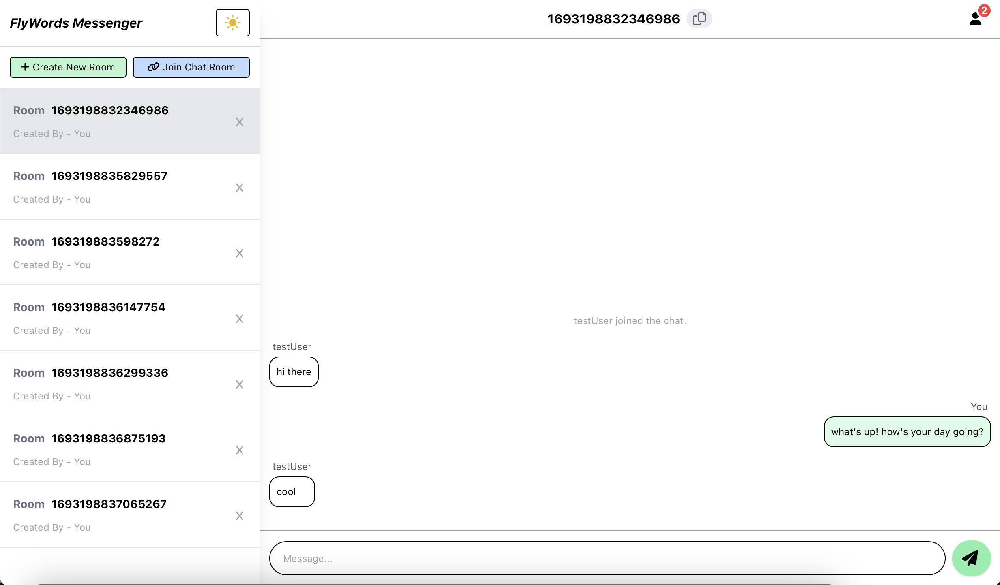
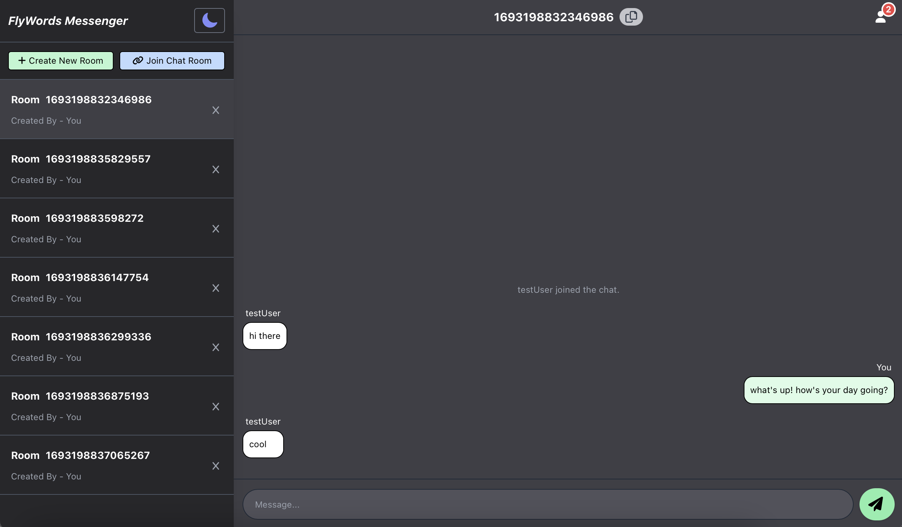
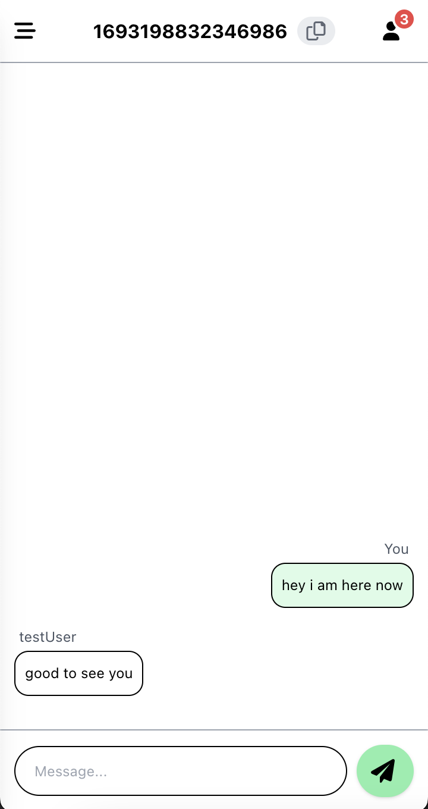
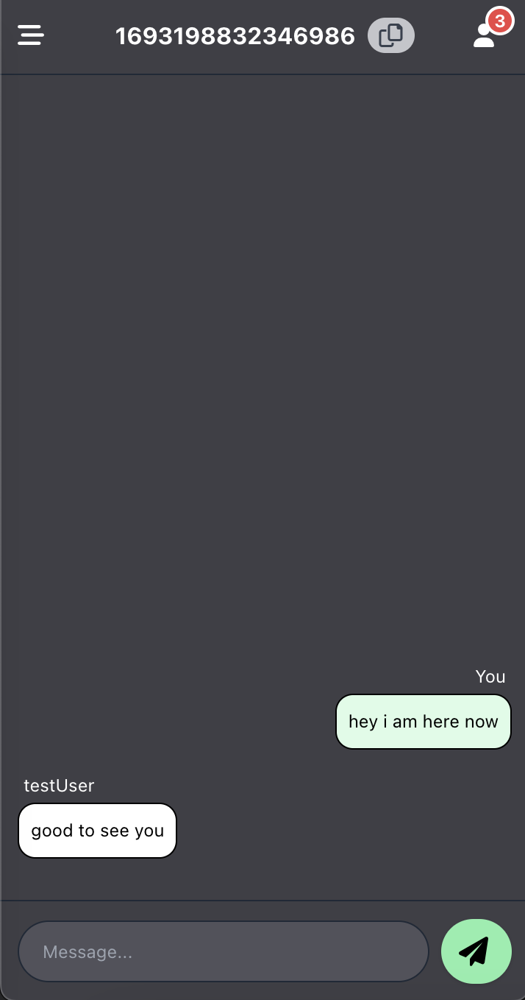

# FlyWords - The NoFuss Messenger

    
    

    
    

- no setup required
- no registration
- no activation
- no OTP
- create room, send ID to your mate, then Chat

Project Details

- End to End Chat
- no Auth
- no Database
- responsive
- minimalist codebase

## Installation Guide

### `clone repo`
### `npm install`
### `yarn server`
### `yarn start`